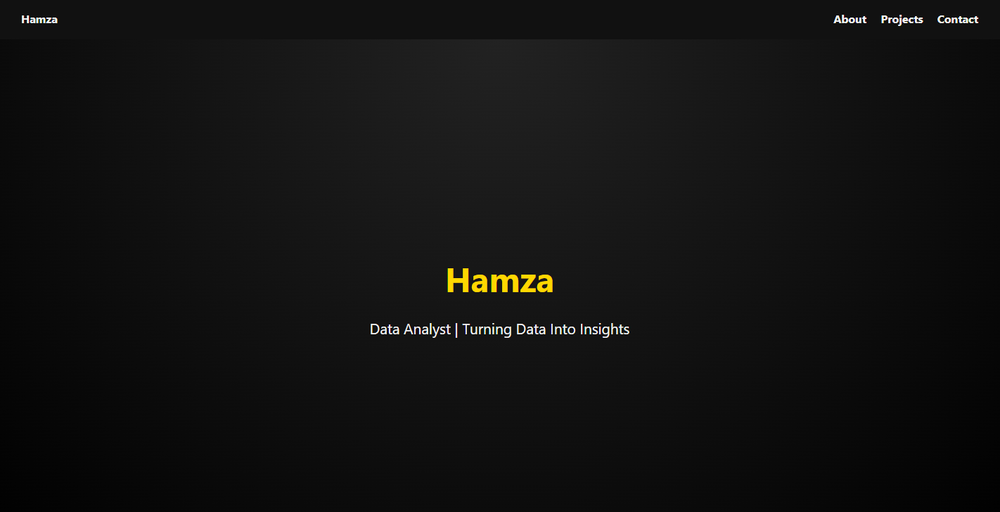
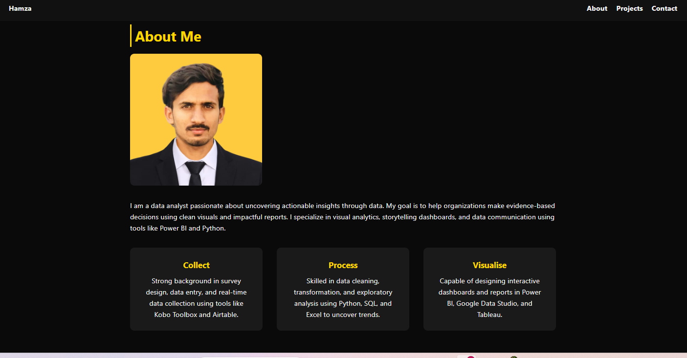
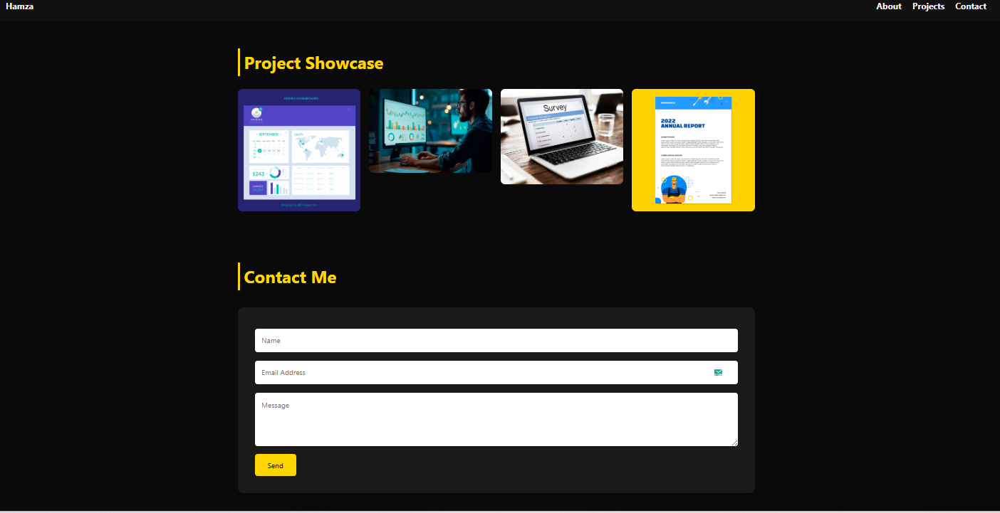

# 🧑‍💻 Hamza's Portfolio Website

This is a clean and responsive personal portfolio website created using HTML, CSS, and basic JavaScript. It showcases my projects, contact information, and skills — ideal for job applications and personal branding.

## 🔗 Live Demo

👉 [View Portfolio Live](https://mhamza-py.github.io/hamza.py/)

---

## 📸 Screenshots

> 📌 *Make sure these image files (`screenshot1.jpg`, etc.) are uploaded in the root of your repo.*

---

## 💡 Features

- Clean and modern UI
- Fully responsive design
- Project showcase section
- Contact form (static)
- Profile photo and personal intro

---

## 🛠️ Technologies Used

- HTML5
- CSS3
- JavaScript (basic)
- Git & GitHub Pages for deployment

---

## 🙋‍♂️ Author

**Hamza**  
📧 Email: contactushamza@gmail.com 
🌐 Portfolio: [Live Link](https://mhamza-py.github.io/hamza.py/)

---

## 📁 Project Structure
hamza.py/
├── index.html
├── profile.jpeg
├── analysis.jpg
├── salesdashboard.jpg
├── surveyform.jpg
├── report.jpg
└── README.md

yaml
Copy
Edit

---

## 📢 Feedback

Have suggestions or want to collaborate? Feel free to open an issue or contact me directly.

